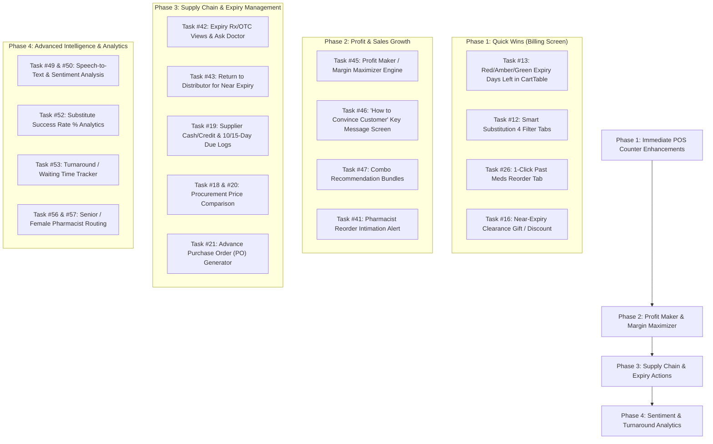

# GENQUANTAA POS Application — Gap Analysis & Pending Tasks Report

**Audit Date:** September 9, 2026  
**Project:** GENQUANTAA Pharmacy Point of Sale (POS) Billing Application  
**Repository:** [ammarraza1199/Pharma_project](https://github.com/ammarraza1199/Pharma_project)  
**File Location in Workspace:** [PENDING_TASKS_REPORT.md](file:///c:/Users/NavyaSri/OneDrive/Desktop/POS/PENDING_TASKS_REPORT.md)  
**Scope:** Comprehensive Analysis of all 6 Handwritten Task Requirement Sheets (Tasks 0 to 57) against POS Frontend Implementation  

---

## 1. Executive Summary & Audit Overview

Following a complete audit of all handwritten requirement sheets (including the newly added **Sheet 5: Tasks #41 to #51** covering Profit Maker, Voice Sentiment Analysis, Reorder Intimations, and Expiry Actions), this report consolidates all **Not Implemented** and **Partially Implemented** features.

### Overall Status Breakdown

| Category | Count | Percentage |
| :--- | :---: | :---: |
| **Fully Implemented & Operational** | **24 Tasks** | **47.0%** |
| **Partially Implemented (Needs Enhancement)** | **6 Tasks** | **11.8%** |
| **Not Yet Implemented (Pending Development)** | **21 Tasks** | **41.2%** |
| **Total Requirements Audited** | **51 Items** | **100%** |

---

## 2. Comprehensive Table of Tasks NOT Yet Implemented (21 Tasks)

The following items currently have **no functional implementation** in the POS frontend codebase:

| # | Handwritten Reference | Feature Name | Target Component / Area | Gap Description & Detailed Functional Requirement |
| :---: | :--- | :--- | :--- | :--- |
| **01** | **Sheet 1 — Task #13** | **Dynamic Expiry Days Left Badges (`Red / Amber / Green`)** | `CartTable.tsx` `ProductSearch.tsx` | Currently shows raw expiry date text (`Exp: 2026-09-30`). **Required:** Calculate real-time `daysLeft` from today: • **Red Badge (<30 days or <10 days urgent):** Critical expiry warning. • **Amber Badge (30–90 days):** Near-expiry warning. • **Green Badge (>90 days):** Healthy shelf-life. • Fast filter to highlight cart items expiring within `<10 days`. |
| **02** | **Sheet 1 — Task #16** | **Near-Expiry Clearance Gift / Extra ₹5–₹10 Discount** | `CartTable.tsx` `CartSummary.tsx` | The cart has a 15% substitute discount, but lacks an automatic or 1-click clearance incentive for near-expiry items (e.g. prompt: *"Near expiry batch: Apply extra ₹5–₹10 clearance discount or add free promotional gift item"*). |
| **03** | **Sheet 5 — Task #41** | **Pharmacist Reorder Intimation / Notification** | `Navbar.tsx` `Dashboard.tsx` `posSlice.ts` | When stock drops below minimum safety threshold, there is no real-time push notification or intimation alert notifying the cashier/pharmacist to place a reorder. |
| **04** | **Sheet 5 — Task #42** | **Expiry Page Rx vs OTC Views & "Ask Doctor" Intimation** | `ExpiryManagementPage.tsx` | In the Expiry Management page: • No dedicated toggle to view **Prescription (Rx) vs OTC** expiring items. • No **"Ask Doctor"** action allowing the pharmacist to contact the prescribing doctor for early dispensing of near-expiry prescription batches. |
| **05** | **Sheet 5 — Task #43** | **Return to Distributor for Near-Expiry Stock** | `ExpiryManagementPage.tsx` `ReturnsPage.tsx` | Near-expiry batches can currently only be marked for disposal. There is no automated workflow to initiate a **Return to Distributor** for credit before the distributor cutoff window (e.g. 60–90 days before expiry). |
| **06** | **Sheet 5 — Task #44** | **Rack / Shelf Selection Robo (Automated Visual Locator)** | `CartTable.tsx` `ProductSearch.tsx` | Location is currently stored only as plain text (e.g., `Rack A-01`). There is no visual/guided shelf-picking assistant ("Robo Rack Selector") directing counter staff to the exact shelf coordinates during high-speed dispensing. |
| **07** | **Sheet 5 — Task #45** | **Profit Maker & Margin Maximizer Recommendations** | `CartTable.tsx` `ProductSearch.tsx` (New Modal) | No high-margin cross-sell engine to help pharmacists maximize gross margin (e.g., suggesting profitable companion items like Dettol, adhesive bandages, cotton, antiseptics, and health supplements based on sales insights). |
| **08** | **Sheet 5 — Task #46** | **"How to Convince Customer" Key Message Overlapping Screen** | `SmartSubstitutionModal.tsx` (New Overlay Screen) | When recommending high-margin or substitute items, there is no overlapping talking-points card providing the pharmacist with the exact persuasive key messages/scripts to convince hesitant patients. |
| **09** | **Sheet 5 — Task #47** | **Combo Recommendations (Clinical & First-Aid Bundles)** | `CartTable.tsx` `CartSummary.tsx` | No smart combo bundling (e.g. Fever Kit: *Paracetamol + Vitamin C + Digital Thermometer*, or Wound Care Kit: *Povidone Iodine + Sterile Gauze + Bandage*). |
| **10** | **Sheet 5 — Task #49** | **Customer Voice Recording with Live Speech-to-Text Transcription** | `VoiceConsultationModal.tsx` | Audio recording is captured as a raw WAV/WebM file, but there is no real-time speech-to-text transcription converting counter conversations into searchable clinical text. |
| **11** | **Sheet 5 — Task #49 & #50** | **Real-Time Customer Sentiment Analysis & Dynamic Recommendations** | `VoiceConsultationModal.tsx` `CartTable.tsx` | No sentiment engine analyzing customer voice/tone (hesitant, price-sensitive, anxious, confident) to dynamically tailor product recommendations and discount incentives. |
| **12** | **Sheet 3 — Task #19** | **Supplier Credit vs Cash Bills & Repayment Due Date (10/15 Days Log)** | `SuppliersPage.tsx` `types/pos.ts` | Current supplier directory only records contact info and static pending dues. **Required:** • Breakdown of purchases by **Cash Bill** vs **Credit Bill**. • Repayment due dates log with **10-day** and **15-day** countdown alerts. • Outstanding supplier payment schedule and settlement status. |
| **13** | **Sheet 1 (#18) & Sheet 3 (#20)** | **Procurement Intelligence & Supplier Price Comparison** | `SuppliersPage.tsx` `PurchaseGRNPage.tsx` | No comparison matrix across distributors. **Required:** • Compare purchase rates across competing suppliers for the same salt/medicine. • Highlight distributor schemes (e.g. *Buy 10 Get 2 Free*, wholesale rebates, liquidation margins). • Recommends the lowest-cost vendor before placing stock orders. |
| **14** | **Sheet 3 — Task #21** | **Advance Purchase Order (PO) Placement to Distributors** | `PurchaseGRNPage.tsx` (New Component / Tab) | The system supports Goods Received Notes (GRN) when items arrive, but does **not** allow pharmacists to generate and dispatch formal **Purchase Orders (POs)** in advance to chosen distributors. |
| **15** | **Sheet 3 — Task #22** | **Return & Refund 15% Restocking Deduction Option** | `ReturnsPage.tsx` `posSlice.ts` | The return system currently calculates refunds at 100% face value. **Required:** Option/toggle to apply a statutory **15% return/restocking depreciation fee** for opened packages, late returns, or customer cancellations. |
| **16** | **Sheet 3 — Task #26** | **Previously Ordered Medicines 1-Click Reorder Tab in POS** | `ProductSearch.tsx` `CartTable.tsx` | Customers' past purchases can only be viewed in History. **Required:** A dedicated **"Reorder Past Meds"** tab in the POS billing panel that lists the customer's previously prescribed drugs and adds them to the active cart with a single click. |
| **17** | **Sheet 4 — Task #52** | **Substitute Intelligence & Acceptance Success Rate Analytics** | `Dashboard.tsx` `ReportsPage.tsx` | Substitute medicines are logged on invoices, but there is no analytics engine tracking: • Total substitutions recommended. • Total accepted vs rejected by patients. • **Conversion Success Rate %** to evaluate pharmacist upselling performance. |
| **18** | **Sheet 4 — Task #53** | **Customer Turnaround & Waiting Time Analytics** | `Dashboard.tsx` `ReportsPage.tsx` | No customer service time metrics. **Required:** Track and display: • Entry time &rarr; Billing time &rarr; Packing time &rarr; Dispatch time. • Average service duration per customer (e.g., Target: `< 3 mins/bill`). |
| **19** | **Sheet 4 — Task #54** | **Customer Adherence / Purchase Behaviour Analysis** | `PatientsPage.tsx` `ReportsPage.tsx` | No tracking of prescription dosage compliance (e.g. patient purchasing only 10 loose tablets when the prescription specifies a 30-day course of 30 tablets). |
| **20** | **Sheet 4 — Task #55** | **Doctor & Diagnostic Lab Referral Volume Analytics** | `ReportsPage.tsx` | Prescribing doctors are logged on Schedule H compliance, but there is no analytics view measuring patient referral volume by clinic/hospital or correlating chronic vs acute cases per doctor. |
| **21** | **Sheet 4 — Task #56 & #57** | **Smart Pharmacist Routing (Senior / Female Pharmacist Selection)** | `TabBar.tsx` `AssignBillModal.tsx` | Pharmacist counters exist, but lack automated routing rules: • Route chronic/VIP patients to **Senior Pharmacists**. • Recommend/route **Female Pharmacists** for Maternity, Women's Wellness, and sensitive consultations with discreet packaging tags. |

---

## 3. Tasks PARTIALLY Implemented in the Frontend (6 Tasks)

These features have foundational code in place, but lack specific capabilities noted in the handwritten requirements:

| # | Handwritten Reference | Feature Name | Current Implementation | Missing Enhancement Required |
| :---: | :--- | :--- | :--- | :--- |
| **22** | **Sheet 1 — Task #12** | **Smart Substitution Multi-Criteria 4-Tab Ranking** | `SmartSubstitutionModal.tsx` lists salt-matched alternatives sorted by generic stock/margin. | **Missing the 4 distinct filter tabs:** 1. *Cost-Effective Substitute (Lowest price / affordable)* 2. *Stock More (Highest inventory in store)* 3. *High Quality Substitute (Top branded pharma)* 4. *Pharmacy Recommended (Balanced margin & safety)*. |
| **23** | **Sheet 1 — Task #17** | **Dump Stock (30-Day) Notification on POS Bill Page** | `InventoryDashboardPage.tsx` has `DUMP_30` filter and clearance discounts. | **Missing live intimation in Billing:** When a cashier scans an item with older dump stock in shelf inventory, the POS cart should intimate/notify the cashier to dispense that specific batch first. |
| **24** | **Sheet 2 — Tasks #39, #40** | **Stock Classification Levels & Dashboard Reorder Recommendations** | `Dashboard.tsx` and `InventoryDashboardPage.tsx` show basic low stock lists. | **Missing 4-tier stock classification bands:** • *Heavy / Overstocked* • *Optimal* • *Trigger Reorder Point* • *Critical Low Stock* with automated EOQ (Economic Order Quantity) suggestions. |
| **25** | **Sheet 2 (#30) & Sheet 3 (#27)** | **Age-Based Coupons & Doctor / Insurance / Lab Recommendations** | `WellnessBrochureModal.tsx` supports age plans; `CartSummary.tsx` has 2 lab test checkboxes. | **Missing:** • Automatic popup of pediatric/adult/senior coupons when patient age is entered. • Referral slips for partner diagnostic labs, empanelled doctors, and health insurance claims. |
| **26** | **Sheet 3 — Task #23** | **Returned Medicine Physical Put-Away / Shelf Restocking Queue** | `ReturnsPage.tsx` auto-increments digital stock totals. | **Missing physical put-away queue:** A dedicated "Restocked Shelf Return Queue" showing returned items waiting for idle counter staff to place back onto physical storage racks. |
| **27** | **Sheet 5 — Task #48** | **Value-Added Products with Discussion Recording** | `VoiceConsultationModal.tsx` records consultation audio. | Recording exists in consultation history, but is not linked directly to the checkout cart for cross-selling value-added health products. |

---

## 4. Fully Implemented Features Matrix (24 Tasks Completed)

| Reference | Implemented Feature | Component Location | Status |
| :--- | :--- | :--- | :---: |
| **Sheet 5 — Task #51** | **Patient Instruction Leaflet (PIL) with 5-Language Voice Clips & Dosage** | `PatientInstructionModal.tsx`, `pilCatalog.ts` | ✅ Completed |
| **Sheet 5 (#0, #7)** | Full billing, GST invoice generation, database history | `InvoicesPage.tsx`, `InvoiceHistoryModal.tsx` | ✅ Completed |
| **Sheet 5 (#1, #3, #4)** | Emergency medicine quick delivery (Snake Bite, Cardiac, Anaphylaxis) | `EmergencyDeliveryPage.tsx` | ✅ Completed |
| **Sheet 5 (#2)** | Counter workload balance & bill transfer between pharmacists | `AssignBillModal.tsx`, `TabBar.tsx` | ✅ Completed |
| **Sheet 1 (#14), Sheet 2 (#38), Sheet 5 (#5)** | Pack strips vs loose tablet calculations & oral dosage metadata | `CartTable.tsx`, `ProductSearch.tsx` | ✅ Completed |
| **Sheet 5 (#6)** | Online & home delivery dashboard with 24-hour SLA countdown | `OnlineDeliveryPage.tsx` | ✅ Completed |
| **Sheet 5 (#8)** | Multi-tender payments (UPI, Credit Card, Debit Card, AutoPay) | `PaymentModal.tsx` | ✅ Completed |
| **Sheet 1 (#15)** | FEFO auto-selection prioritizing closest expiry batch | `fefoHelper.ts` | ✅ Completed |
| **Sheet 3 (#24)** | Chronic refill for BP, Diabetes, Hypertension with WhatsApp alert | `ChronicRefillModal.tsx` | ✅ Completed |
| **Sheet 3 (#25)** | Prescription image upload & OCR medicine extraction | `PrescriptionUploadModal.tsx` | ✅ Completed |
| **Sheet 3 (#28)** | Health insights & personalized patient care plan with vitals | `PatientsPage.tsx` | ✅ Completed |
| **Sheet 2 (#29)** | Health & wellness patient brochures across 6 clinical conditions | `WellnessBrochureModal.tsx` | ✅ Completed |
| **Sheet 2 (#31, #33)** | Multi-branch stock inquiry & store-to-store pickup routing | `MultiStoreModal.tsx` | ✅ Completed |
| **Sheet 2 (#32)** | Inter-store AI chatbot connecting pharmacy branches | `InterStoreChatbotModal.tsx` | ✅ Completed |
| **Sheet 2 (#34, #35)** | Inter-pharmacy borrowed stock tracking & wholesale price adjustment | `MultiStoreModal.tsx` | ✅ Completed |
| **Sheet 2 (#36, #37), Sheet 5 (#10)** | Substitute item display with `"You saved ₹XX.XX!"` banner | `CartTable.tsx`, `CartSummary.tsx` | ✅ Completed |
| **Consultation Foundation** | Voice consultation recording & audio storage | `VoiceConsultationModal.tsx` | ✅ Completed |

---

## 5. Prioritized Implementation Blueprint

